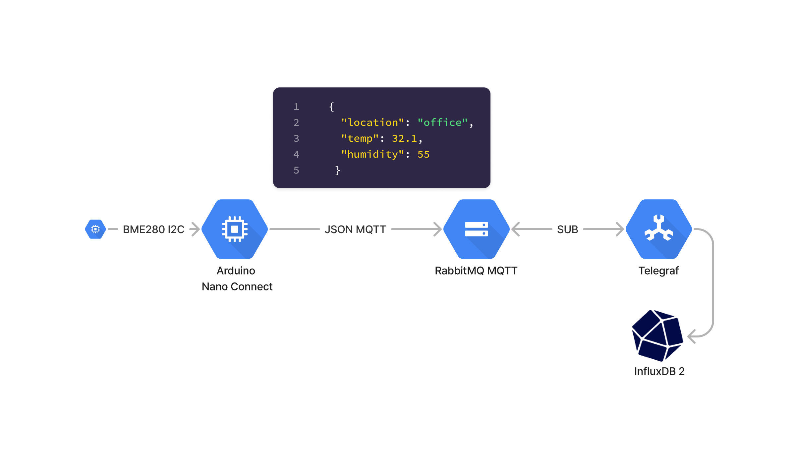

# README

## Overview


## Setup
- [ ] Move docker configuration to docker compose

```
docker run -d --hostname rabbithost --name rabbit-name rabbitmq:3
docker run -d --hostname rabbit-chg --name rabbit-mgmt -p 8080:15672 -p 1883:1883  rabbit-management-chg:latest
docker run -d --name=influxdb -p 8086:8086 -v  /tmp/testdata/influx:/root/.influxdb2 influxdb:2.0
docker run -d -v $PWD/telegraf.conf:/etc/telegraf/telegraf.conf:ro telegraf
```

You need a InfluxDB API token, here is a .
